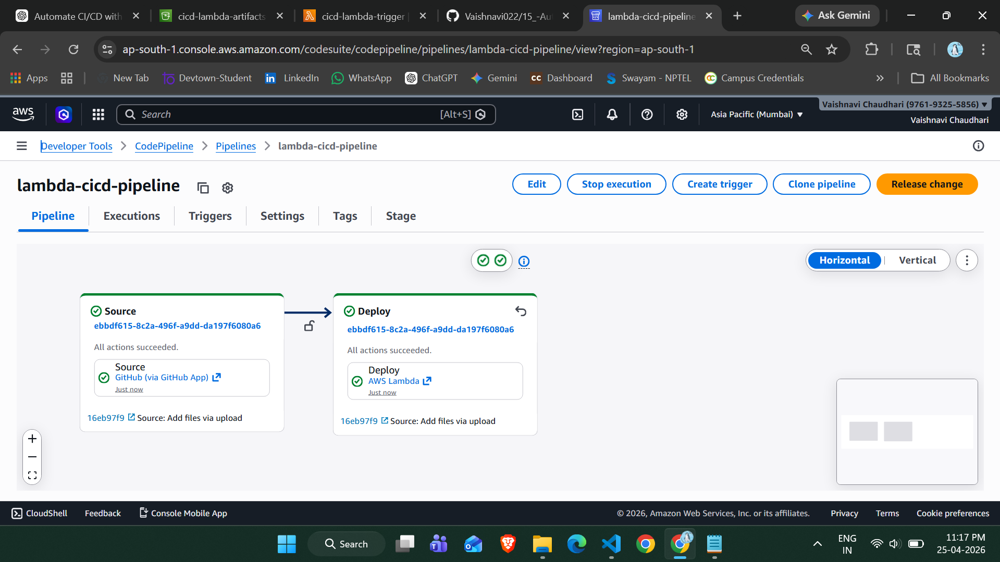

# 🚀 Automate CI/CD Pipeline using AWS Lambda & CodePipeline

---

## 🎯 Project Overview

This project demonstrates how to build an automated CI/CD pipeline using AWS services. The pipeline is triggered whenever code is pushed to GitHub and automatically invokes an AWS Lambda function for deployment.

---

## 🧰 AWS Services Used

* AWS CodePipeline (CI/CD automation)
* AWS Lambda (Serverless compute)
* Amazon S3 (Artifact storage)
* GitHub (Source code repository)

---

## 🏗️ Architecture

GitHub → CodePipeline → S3 (Artifacts) → Lambda

---

## ⚙️ Step-by-Step Implementation

---

### 🔹 Step 1: Create GitHub Repository

* Repository Name: `15_-Automate-CI-CD-Pipelines-using-Lambda`
* Add project file:

```js
console.log("Hello from CI/CD Pipeline 🚀");
```

---

### 🔹 Step 2: Create S3 Bucket

* Bucket Name: `cicd-lambda-artifacts-<yourname>`
* Region: ap-south-1 (Mumbai)
* Block Public Access: Enabled
* Used to store pipeline artifacts (ZIP files)

---

### 🔹 Step 3: Create Lambda Function

* Function Name: `cicd-lambda-trigger`
* Runtime: Python 3.x

#### Lambda Code:

```python
import json

def lambda_handler(event, context):
    print("🚀 CI/CD Pipeline Triggered Successfully!")
    print("Event:", json.dumps(event))
    
    return {
        'statusCode': 200,
        'body': json.dumps('Lambda executed successfully!')
    }
```

---

### 🔹 Step 4: Create CodePipeline

* Pipeline Name: `lambda-cicd-pipeline`
* Artifact Store: S3 Bucket
* Source Provider: GitHub
* Build Stage: Skipped
* Deploy Stage: AWS Lambda

---

### 🔹 Step 5: Connect GitHub

* Select your repository
* Branch: `main`
* Authorize GitHub connection

---

### 🔹 Step 6: Configure Deploy Stage

* Deploy Provider: AWS Lambda
* Function Name: `cicd-lambda-trigger`

---

### 🔹 Step 7: Run Pipeline

* Click **Release Change**
  OR
* Push code:

```bash
git add .
git commit -m "Trigger pipeline"
git push
```

---

## 🔁 CI/CD Workflow

1. Code pushed to GitHub
2. CodePipeline detects changes
3. Code is packaged into ZIP and stored in S3
4. Lambda function is triggered
5. Deployment completes automatically

---

## 📸 Screenshots

> 📁 Store all images inside `images/` folder

### 🖼️ Image Names

* `01_s3_bucket_created.png`
* `02_lambda_function_created.png`
* `03_lambda_code.png`
* `04_pipeline_creation.png`
* `05_pipeline_success.png` ⭐ (Final Output)

---

## 🖼️ Final Output



---

## 📦 Important Note (S3 Storage)

* Files are NOT visible individually in S3
* CodePipeline stores code as ZIP artifacts

Example:

```
source_artifact.zip → contains app.js
```

## 🧠 Key Learning

* CI/CD automation using AWS
* Serverless deployment using Lambda
* Artifact management using S3
* GitHub integration with AWS

---

## 🚀 Final Result

✔ Automated CI/CD pipeline
✔ GitHub → Lambda deployment
✔ No manual intervention

---

## 💡 Future Enhancements

* Add AWS CodeBuild (build stage)
* Deploy application to EC2 or S3
* Add monitoring with CloudWatch

---

## 🙌 Conclusion

This project successfully demonstrates how to automate deployments using AWS Lambda and CodePipeline, enabling efficient and scalable CI/CD workflows.
